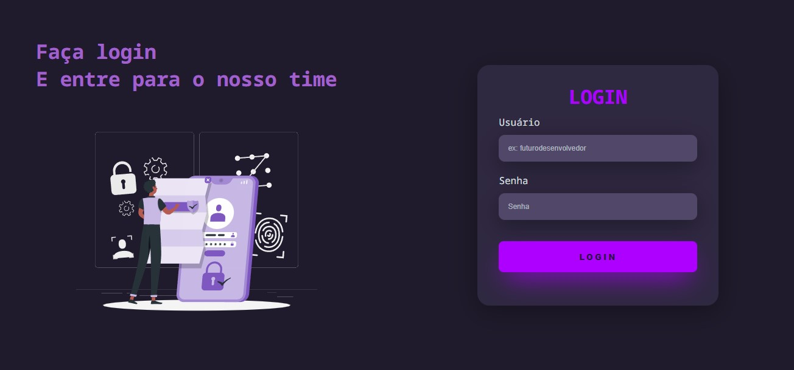

<h1>Olá, vamos realizar o login? 👋</h1>

<h4>Através das aulas de HTML e CSS pelo <strong><a href="https://rodolfomori.com.br/devclub-privado/" target="_blank">DevClub</a></strong> com o <a href="https://github.com/rodolfomori" target="_blank">Rodolfo Mori</a>, desenvolvi um site responsivo de login.</h4>
<h2></h2>

<h2>🔧 As ferramentas utilizadas foram: ✔</h2>

<h2>✔ Para acessar o site basta acessar o link abaixo:</h2>
<h3><a href="https://erikvasconcelos.github.io/dark-login-website-responsive/" target="_blank">Login Website 💻</a></h3>
<h2></h2>
<h3>Muito obrigado pela visita e volte sempre 📌</h3>

Estarei aqui para ajudar 👨‍💻

